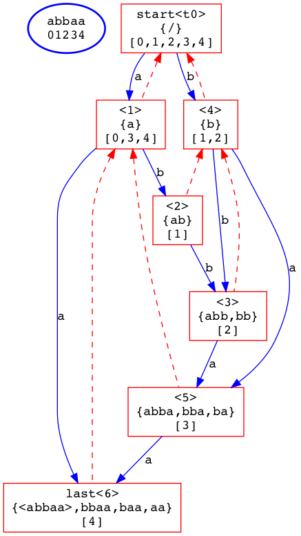
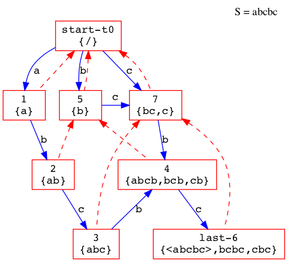

# 后缀自动机 - SAM

Suffix Automaton

后缀自动机是一种用来识别一个串`S`是否是模式串`P`的某个真后缀的**最小化的有限状态自动机**

## 非正式化举例

SAM不仅可以识别是否是后缀，还能识别所有子串

可以说：模式串`P`的SAM，就是模式串所有**本质不同子串**的最小化表示。

也就是说，SAM表示了某字符串的所有子串

举例：

例如字符串`abbaa`，它的SAM为



其中，每个方框代表一个状态

第一行表示节点的ID，与算法无关

第二行表示当前状态代表的所有子串，组内共为一个等价类

第三行表示该状态的`end-pos`，表示最长的那个字符串在母串中的位置的末尾

蓝色线表示状态转移边，其定义与自动机相同

红色的虚线表示「后缀连接」，其含义为：

若`link(u)=v`，则对于`u`中的所有子串，均具有`v`中子串那样的后缀

再举一例：



观察状态`3->7`与`6->7`

`3:{abc} -> 7:{bc,c}`

`6:{abcbc,bcbc,cbc} -> 7:{bc,c}`

## 定义

### `max & min`

`max` 指这个节点所表示的最长子串的长度

`min` 同理，指最短子串的长度

### `end-pos`

`end-pos`与`link`(后缀连接)同为SAM的核心

`end-pos`的定义很简单，对于某个子串，它的`end-pos`指它在母串中的位置的末尾（字符串下标从零开始）。

具有相同`end-pos`的子串被划分为一个等价类，`end-pos`具有以下性质：

**性质1** 对于`end-pos`相同的两子串`a` `b`，较短串的每次出现必以较长串的后缀形式存在。

**性质2** 对于两个`end-pos`集合`sa` `sb`，它们要么呈现包含关系，要么完全不相交

证明：否则，假设`sa`与`sb`相交但不覆盖，那么至少存在一个位置使得`end-pos(a)[i] == end-pos(b)[j] == k`，也就是说，在位置`k`，子串`a` `b`必定呈后缀关系，因此子串`a` `b`必定呈后缀关系，根据性质1，这与假设「不覆盖」相矛盾。

因此两集合要么覆盖，要么互斥。

**性质3** 对于一个`end-pos`等价类，最长串与其他所有较短串呈后缀包含关系，将这些字符串按长度排序，则元素长度之间的步进保持为1。但长度的最小值可能无法到0，因为存在**后缀连接**

### 后缀连接

后缀连接反映了状态与状态间的后缀包含关系，且`link(u)`指向的`v`是最长的那个状态（最长形容的是某状态的最长子串的长度）


也就是说，状态`3:{abc}`同时存在后缀状态`7:{bc,c}`与`0:{/}`，但状态7较长，因此`link(3)=7`

可见，由于后缀是一种长度缩短的变换，从任意非根状态出发，沿着后缀连接游走，最后一定会回到根节点。因此，后缀连接将状态组织成了一棵树。

**性质4** 后缀连接所组织的树与`end-pos`的划分树等价

由后缀性质与性质2共同作用可得。

**性质5** `min(u) = max(link(u)) + 1`

## SAM算法

SAM的构造是一种增量算法。

假设算法已经正确地构造了模式串`S`的SAM，现在想要在`S`的末尾添加字符`c`，以构造`S#c`的SAM（`#`为连接符）。

`last`指向了上一次构造完成后，含有`S`母串的状态节点

`start`指向根节点`t0`

对于插入字符`c`，算法具体过程如下：

```javascript
00 | // Transfer(a, c) 指从状态a利用字符c进行转移
01 | u <- 新节点 with {max = max(last) + 1}
02 | v <- last
03 | 
04 | while (v非空 且 v没有关于c的转移):
05 |     Transfer(v, c) <- u
06 |     v <- link(v)
07 | 
08 | 如果 (v为空):
09 |     link(u) <- start
10 | 否则 如果 (max(Transfer(v, c)) == max(v) +1):
11 |     link(u) <- Transfer(v, c)
12 | 否则:
13 |     old <- Transfer(v, c)
14 | 
15 |     clone <- 克隆节点(old)
16 |     max(clone) <- max(v) + 1
17 | 
18 |     link(old) <- clone
19 |     link(u) <- clone
20 | 
21 |     while(v非空 且 Transfer(v, c) == old):
22 |         Transfer(v, c) <- clone
23 |         v <- v.link
```

解释：

算法由新建一个节点`u`开始，并将新节点的`max`属性置为`max(last)+1`。目的很明显，因为字符是连续增量添加的，且`last`一直指向上次构造后，可以代表整个串的状态节点。因此，根据`max`属性的语义，这样初始化新节点是合乎情理的。

然后，一个`while`循环将`last->root`这个后缀连接路径上的某些节点指向新节点`u`。

这里需要讨论一下「后缀连接」的含义。由上面的定义与性质可以得出，一个非根节点到根的后缀连接路径始终是这个非根节点的真后缀，且随着后缀连接的跳转，这个真后缀长度递减直到0.

所以，这个`while`的语义是：向`last`以及`last`的后缀中，添加不冲突的`c`转换，直到跳转到根节点的后缀连接（也就是NULL），或者发现了一个冲突的状态节点（已经存在`c`引起的转换）。

然后进入一个三分支的判断：

I. **如果v为空**。这意味着达到了一个`NULL`的后缀连接，也就是走到了`start`节点的位置，也意味着这条后缀路径上不存在具有字符`c`出边的节点，那么就认为这个节点是一个匹配的起始状态。因此，将`u`的前缀连接指向根`start`.

II. **如果`max(Transfer(v, c)) == max(v) +1`**。令`q=Transfer(v, c)`，则`q`代表了`v`发生转移`c`冲突时的目标节点。这部分代码的意思是：如果`q`中最长的子串恰好是`v`中最长的子串在最后添加字符`c`后得到的，那么就将`u`的后缀连接指向`q`

证明：

```javascript
设这个后缀连接中，由节点p跳到v
link(p) = v
则 A. max(v) = min(p) - 1

且p添加了指向新建节点u的转移c (while循环的上一次)
Transfer(p, c) = u
则 B. min(u) = min(p) + 1

因为冲突，Transfer(q, c)存在
对于最长的字符串有 max(q).str = max(v).str + c (末尾添加字符c)
则 C. max(q) = max(v) + 1

联立ABC:

min(u) = max(v) + 1 + 1
       = max(q) + 1

由性质5可得 link(u) = q，即u的后缀连接指向q
```

III. 否则，将节点`q`拆分，使其可以被新节点`u`的后缀连接使用。

到了这一个判断分支，可以断言`max(q) > max(v) + 1`，因此不能直接将`u`的后缀连接指向`q`。因为`q`中存在着以字符`c`结尾**但是更长**的后缀。因此，我们需要把这个**更长**的后缀拆成适当长度，也就是`max(v)+1`那么长的一个后缀与原始后缀。

形象展示如下

```javascript
// u只能后缀指向Bc，但目前是ABc
v -> q{ABc}
// 拆分
q{ABc} -> clone{BC} & old{ABc}
// u这时就可以连到clone了
link(u) = clone
link(old) = clone
```

随后，需要修正一系列原有的链接，因为以前到`q`的那些转移现在被`clone`节点代替，因此需要更换。

## 应用

### 寻找所有本质不同子串

本质不同：不仅位置不同，还得内容不同

由性质3知，一个状态节点表示的子串在长度上是严格以1为步进递增的，因此只要知道了上下限，便可以轻易得到一个节点代表的本质不同子串的数量。对所有节点求其和，便可得到结果。

### 求字符串的最小循环移位子串

首先，将两个目标串`S`进行串接，得到`SS` ，易知最小子串一定作为一个长度为`len(S)`的子串存在于`SS`中。

又因为SAM可以表示一个串的所有子串，因此，首先对`SS`建立SAM，然后从根节点出发，每次选择`ascii`最小的边进行游走。游走`len(S)`次后，所经历的边顺次相接便是结果。

## 代码

```c++
#include <iostream>

using namespace std;

constexpr int CHAR_SET = 26;

class Node {
  public:
    Node(int id, int max = 0) : link(nullptr), max(max), id(id) {}

    int get_min() {
        if (link) return link->max + 1;
        return -1;
    }

    int get_max() { return max; }

    int get_link() {
        if (link) return link->id;
        return -1;
    }

    char get_minimal_next() {
        for (char i = 0; i < CHAR_SET; ++i) {
            if (ch[i]) return i;
        }
        return 0;
    }

    Node *ch[CHAR_SET]; // 转移表
    Node *link;         // 后缀连接
    int id;             // debug
    int max;
};

class SuffixAutomaton {
  public:
    SuffixAutomaton() {}

    void init() { start = last = new_node(); }

    Node *new_node(int max = 0) {
        auto tmp = new Node(cnt++, max);
        return tmp;
    }

    Node *extend(char ch) {
        int c   = into(ch);
        Node *u = new_node(last->max + 1);
        Node *v = last;

        // last引起的后缀连接路径上没有出边c的节点v全都连向u
        while (v && !v->ch[c]) {
            v->ch[c] = u;
            v        = v->link;
        }

        if (!v) {
            // v跳进了null，这意味着到了树根
            u->link = start;
        } else if (v->ch[c]->max == v->max + 1) {
            // 将要转移到的状态为q = v->ch[c]
            // case.1 q.max == p.max + 1
            u->link = v->ch[c];
        } else {
            // case.2 q.max != p.max + 1
            Node *clone = new_node(v->max + 1);
            Node *old   = v->ch[c];

            // 节点拷贝
            std::copy(old->ch, old->ch + CHAR_SET, clone->ch);
            clone->link = old->link;

            old->link = u->link = clone;

            // 只要存在一条由c引起的后缀连接节点的转移，就重定向到clone
            while (v && v->ch[c] == old) {
                v->ch[c] = clone;
                v        = v->link;
            }
        }
        // 都要更新last
        last = u;
        return u;
    }

    int into(char ch) { return ch - 'a'; }

    void dfs(Node *cur, const string &ident = "") {
        cout << ident << cur->id << " Min: " << cur->get_min() << " Max: " << cur->get_max()
             << " Link: " << cur->get_link() << endl;
        for (char i = 0; i < CHAR_SET; ++i) {
            if (cur->ch[i]) {
                cout << ident << ":`" << (char)('a' + i) << "` -> " << endl;
                dfs(cur->ch[i], ident + '\t');
            }
        }
    }
    void debug() { dfs(start); }

    int cnt = 0;
    Node *start;
    Node *last;
};

// 本质不同子串
void cnt_substrs(SuffixAutomaton &sam, const string &s) {
    sam.init();
    int ans   = 0;
    int len   = 0;
    auto calc = [](int a) { return a * (a + 1) / 2; };
    for (char c : s) {
        Node *now    = sam.extend(c);
        int now_max  = now->get_max();
        int link_max = now->get_min() - 1;
        ans += now_max - link_max;
        len += calc(now_max) - calc(link_max);
    }
    cout << "Total: " << ans << endl;
    cout << "Length of all: " << len << endl;
    cout << endl;
}

// 字符串最小表示（循环移位字典序最小）
void minimal_str(SuffixAutomaton &sam, const string &s) {
    sam.init();
    for (char c : s + s) sam.extend(c);

    int n     = s.size();
    Node *cur = sam.start;

    cout << "Min(`" << s << "`) = `";
    for (int i = 0; i < n; ++i) {
        char c = cur->get_minimal_next();
        cout << (char)(c + 'a');
        cur = cur->ch[c];
    }
    cout << "`" << endl;
}

int main() {
    SuffixAutomaton sam;

    // 1. 求本质不同子串数量与子串总长度
    // aba -> a b ab ba aba 5 9
    // abbaa -> a b ab bb ba aa abb bba baa abba bbaa abbaa 12 32
    cnt_substrs(sam, "abbaa");
    // sam.debug();

    // 2. 求字符串的最小表示
    minimal_str(sam, "abbaa"); // aaabb

    return 0;
}
```

## 参考资料

[https://oi-wiki.org/string/sam/](https://oi-wiki.org/string/sam/)

[https://oi.men.ci/suffix-automaton-notes/](https://oi.men.ci/suffix-automaton-notes/)

[http://codeforces.com/blog/entry/20861](http://codeforces.com/blog/entry/20861)
